# Model Creation with Sci-kit Learn

This repository shows one of my assignments in Machine Learning where I have achieved an almost perfect score of 9.9/10.0 as shown below:


With the Python notebook in this repository, we experiment with a synthetic dataset shaped like dual moons, and we attempt to create and fit models best of the synthetic data.

Specifically, we write code to generate the feature matrix `X` and the target array `y` using the `make_moons` function from the `sklearn.datasets` module with the parameters: `n_samples=250`, `noise=0.1`, and `random_state=42`. After creating the dataset, call `plot_decision_surface(X, y)` to visualize the data distribution.

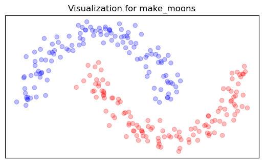

## Part 1: Train-Test Split

Write code to split the generated dataset into training and testing sets, allocating 80% of the data for training and 20% for testing. Use `random_state=42` to ensure reproducibility. Store the resulting arrays in `X_train`, `X_test`, `y_train`, and `y_test`. After creating the dataset, call again `plot_decision_surface(X_train, y_train, X_test, y_test)` to visualize the train and test data distribution.

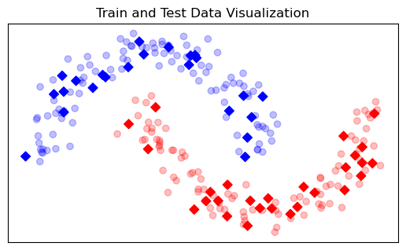

## Part 2: Logistic Regression and Model Creation

Write code to fit a logistic regression model to the training data and store the model in a variable called `logistic`. Then, calculate the accuracy for both the training and testing sets, and store the results in `train_accuracy` and `test_accuracy`, respectively.

## Part 3: Logistic Regression Decision Boundary

Provide substantiated answers to the following questions:

1. What issues, if any, do you observe in the model’s performance or behavior? Is the decision boundary well-suited to the underlying structure of the data?
2. Are there specific areas where the model underperforms? If so, do you believe accuracy alone is an adequate metric to evaluate the model’s performance?
3. Do you think logistic regression is an appropriate model for this dataset? Why or why not?
4. Does the model appear to overfit or underfit the data? What evidence supports your conclusion?

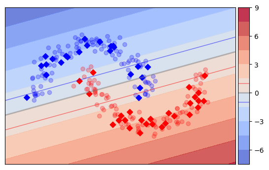

## Part 4: Decision Tree Model Creation

Write code to fit a decision tree classifier to the training data and store the model in a variable named `dt`. Next, compute the accuracy, precision, and recall for both the training and testing sets, and store the results in the following variables: `train_accuracy`, `train_precision`, `train_recall`, `test_accuracy`, `test_precision`, and `test_recall`.

## Part 5: Decision Tree Classifier Boundary

Provide well-supported answers to the following questions:
1. Why is the decision tree model a good fit for this dataset?
2.  Why is the decision boundary of the decision tree seems a heavyside step function? Does this structure contribute to overfitting or underfitting, and can you observe these issues in specific regions of the data?
3.  How do the decision boundaries produced by decision trees differ from those of logistic regression, particularly when dealing with nonlinear patterns?
4.  What are the strengths and weaknesses of decision trees compared to logistic regression?

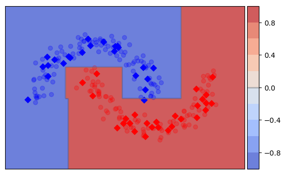
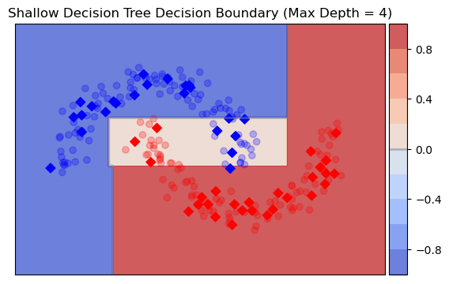

## Part 6: SVM Model Creation

Write code to fit a Support Vector Machine (SVM) classifier with an RBF kernel to the training data and store the model in a variable named `svm`. Then, calculate the accuracy, precision, recall, and F1-score for both the training and testing sets, storing the results in the following variables: `train_accuracy`, `train_precision`, `train_recall`, `test_accuracy`, `test_precision`, `test_recall`, and `test_f1`.

## Part 7: SVM Model Decision Boundary

Provide well-reasoned answers to the following questions:
1. Why is the SVM a good fit for this dataset?
2. How do support vectors determine the decision boundary, and what impact does this have on the model's effectiveness?
3. Why does the SVM produce a smooth, continuous decision boundary, unlike the 'blocky' boundaries seen in decision trees?
4. How do the decision boundaries of SVM differ from the linear boundaries of logistic regression?
5. What are the strengths and weaknesses of SVM compared to logistic regression and decision trees?
6. In what scenarios might logistic regression be more suitable, and when would SVM be a better choice?
7. How do support vectors shape the SVM's decision boundary, and how does this differ from the recursive partitioning method used by decision trees?

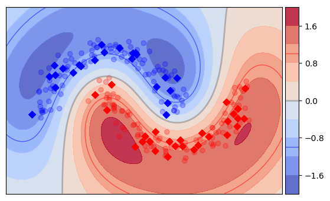

## Part 8: Generating an Increasingly Noisy dataset

The dataset used in the previous exercies had an easy and well-defined decision boundary. However, real business datasets contains noise and errors, making the classification task more complex and intrincate. To generate a more realistic dataset, write code to generate a new feature matrix `X` and a target array `y` using the `make_moons` function with the parameters: `n_samples=250`, `noise=0.4`, and `random_state=42`. Then, split the generated dataset into training and testing sets, allocating 80% of the data for training and 20% for testing. Use `random_state=42` to ensure reproducibility. Store the resulting arrays in `X_train`, `X_test`, `y_train`, and `y_test`. Finally, call again `plot_decision_surface(X_train, y_train, X_test, y_test)` to visualize the new train and test data distribution.

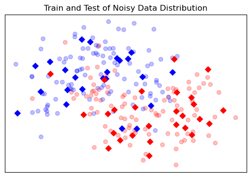

## Part 9: Impact of Noise on Machine Learning

Provide well-supported answers to the following questions:
1. How do you think increased noise in the dataset will impact model performance? Which model do you expect to handle noise best, and why?
2. How might the logistic regression model be affected by noisy data?
3. How do you think noise will influence the decision tree model? Will the step-like characteristic of the boundaries of decision trees become more irregular or over-complicated due to noise? How might this affect performance, especially on unseen data?
4. How will the SVM's decision boundary be influenced by noisy data? Do you expect SVM to become more sensitive to noisy data points near the boundary? How might this impact the margin, support vectors, and lead to overfitting or a reduction in margin width?
5. What strategies can be used to mitigate the effects of noise on these models?

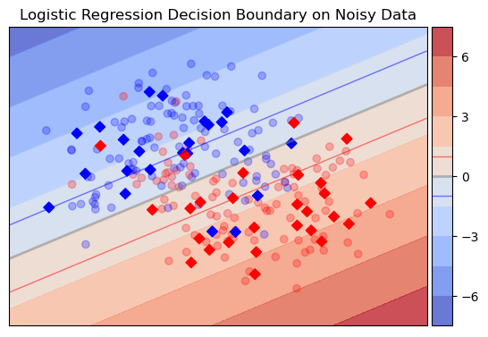
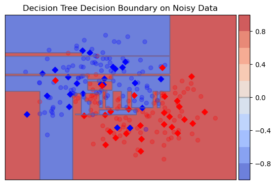
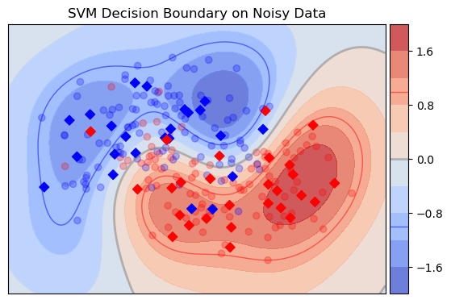

## Part 10: Adding a Regularization Term

Now, it's time to explore the impact of hyperparameters on model performance. We write a function called `get_metrics(model, X, y)`, where the first parameter is a pre-trained model, `X` is the feature matrix, and `y` is the target array. This function should return a dictionary containing key-value pairs for the following metrics: accuracy, precision for class 0 and class 1, recall for class 0 and class 1, and F1-score for class 0 and class 1. The dictionary should be structured as follows:

```python
{
   'accuracy': accuracy, 
   'precision_class_0': precision_class_0, 
   'precision_class_1': precision_class_1, 
   'recall_class_0': recall_class_0, 
   'recall_class_1': recall_class_1, 
   'f1_class_0': f1_class_0, 
   'f1_class_1': f1_class_1
}
```

Next, train three SVM models using the following values for the `gamma` parameter: `0.01`, `'scale'`, and `100`, while keeping the other hyperparameters at their default values. Store these models in a dictionary called `svm_models`, where each key is the corresponding `gamma` value and the value is the trained model. Use the function `get_metrics(model, X, y)` to generate two DataFrames `train_metrics`, and `test_metrics` to store performance metrics and its corresponding `gamma` value. Finally, find the model with the highest accuracy and store it in a variable called `best_svm`.

## Part 11: SVM Regularization Effect

Provide well-reasoned answers to the following questions:
1. How does adjusting the `gamma` parameter impact the model’s complexity? Which values of `gamma` produce a smoother, more generalized decision boundary, and how does this affect the model's ability to handle noise? Conversely, which values result in a more complex decision boundary that may overfit the data, including noise?
2. Can you pinpoint regions where overfitting or underfitting occurs based on the different `gamma` values?
3. How do precision and recall vary as you change the `gamma` parameter? Does a higher `gamma` lead to better precision at the expense of recall, or the opposite?
4. How do the test set metrics compare to the training set metrics for different `gamma` values?
5. Based on these observations, which model would you select, and why?
6. What modifications could be made to improve the chosen model's performance on the noisy dataset?

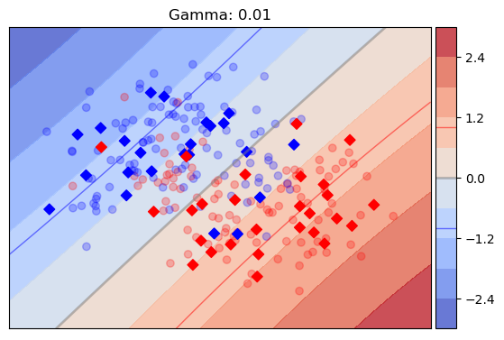
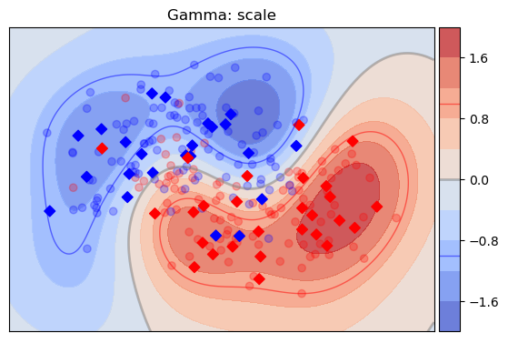
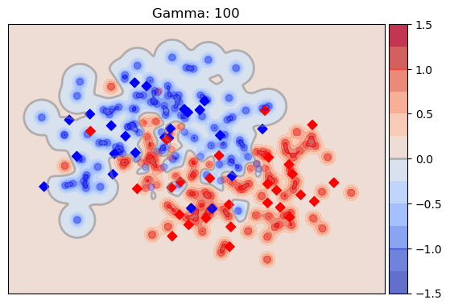

## Part 12: Increasing Size of Dataset

Now, let's retrain the least regularized SVM model with `gamma` set to 100, but this time using a larger dataset. Generate the dataset using the `make_moons` function with the parameters: `n_samples=2500`, `noise=0.4`, and `random_state=42`. Next, split the dataset into training and testing sets, with 80% of the data for training and 20% for testing, ensuring reproducibility by using `random_state=42`. Store the resulting arrays as `X_train`, `X_test`, `y_train`, and `y_test`.

Fit the SVM model using the training data and store it in a variable called `non_regularized_svm`. Then, use the `get_metrics` function to compute the performance metrics, as done in the previous exercise, and append the results to the `train_metrics` and `test_metrics` dataframes.

Finally, add a new column named `dataset_size` to the metrics dataframes, assigning a value of `2500` for the new `non_regularized_svm` model and `250` for the previous models.

## Part 13: Impact of Size of dataset on Machine Learning

Provide well-reasoned answers to the following questions:
1. How does increasing the dataset size help to reduce overfitting and improve the model’s test performance?
2. As more data is added, how does the SVM's decision boundary become smoother, allowing the model to generalize better and avoid fitting to noise?
3. How do the test metrics (such as accuracy, precision, and recall) improve in relation to the training metrics as the dataset size grows?
4. Is there a point where adding more data stops providing significant improvements in performance?
5. Why does increasing the dataset size help counterbalance the high `gamma` value, thereby reducing overfitting?
6. How does the increase in data help the model create a smoother decision boundary?
7. Would you still consider lowering the `gamma` value, or is increasing the dataset size sufficient to address overfitting in this case?
8. In which situations might increasing the dataset size alone not be enough to mitigate overfitting, and how could adjusting the `gamma` parameter help in such cases?
9. After evaluating the effect of dataset size on overfitting, which model would you choose? Do you believe that increasing the dataset size sufficiently improves the performance of the high-`gamma` model, or would a lower-`gamma` model perform better for this dataset?"

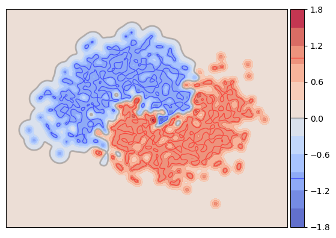
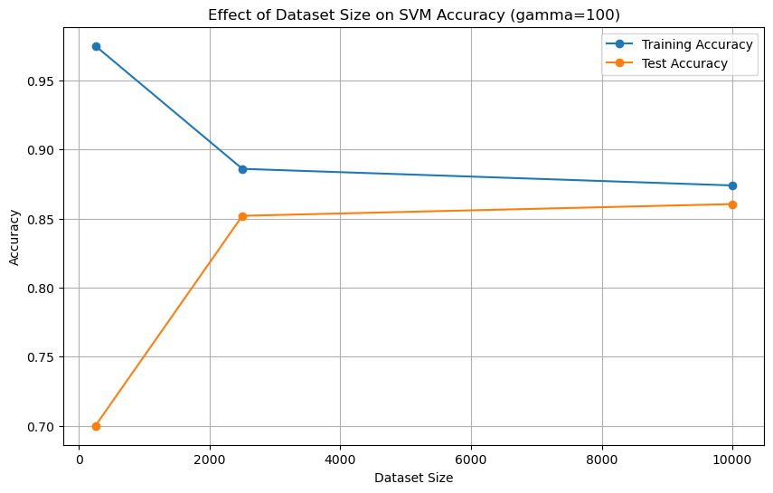
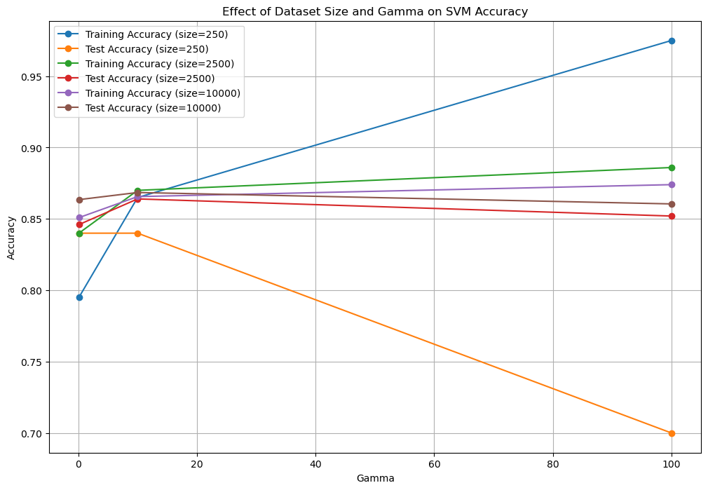
